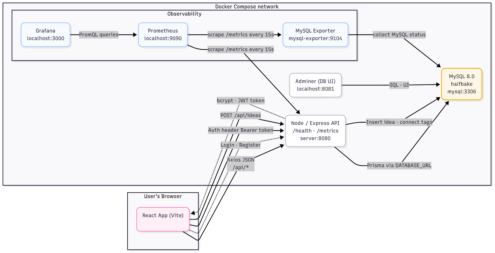
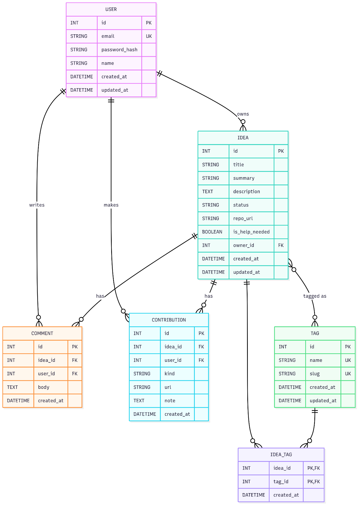
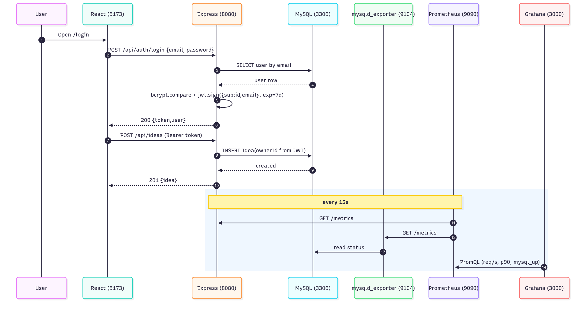
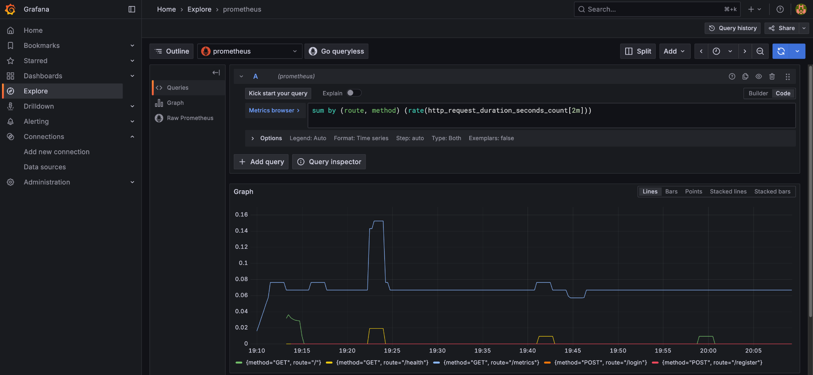
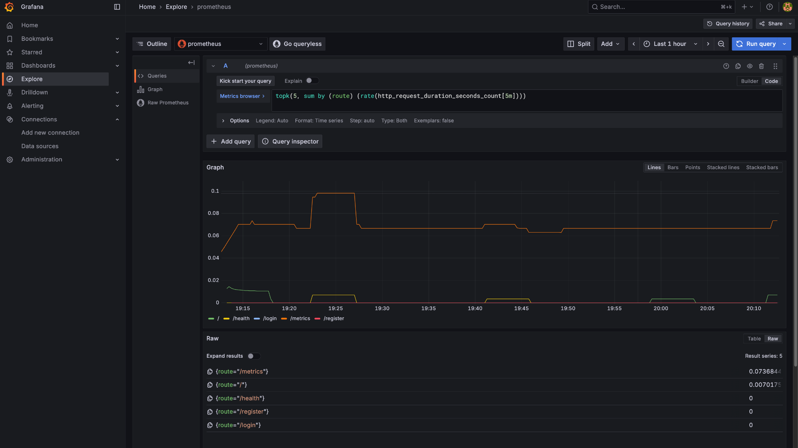

# HalfBake — Share half-baked ideas, let others run with them 🚀

A modern web app for posting “half-baked ideas” so others can pick them up, discuss, and contribute.

- **Frontend:** React (Vite), React Router, TanStack Query, Tailwind, Framer Motion  
- **Backend:** Node/Express, Prisma ORM, Zod validation, JWT auth  
- **Database:** MySQL 8 (Docker) + Adminer UI  
- **Observability:** Prometheus, mysqld_exporter, Grafana (API & DB metrics)  
- **Orchestration:** Docker Compose

> This README is sanitized: **no passwords or secrets**. Configure those in `.env` (never commit it).

---

## Table of contents

- [Features](#features)
- [System diagrams](#system-diagrams)
- [Tech stack](#tech-stack)
- [Project structure](#project-structure)
- [Setup (Docker)](#setup-docker)
- [API quickstart](#api-quickstart)
- [Observability](#observability)
- [Troubleshooting](#troubleshooting)
- [License](#license)

---

## Features

- ✨ Polished landing page (glassy/gradient theme)
- 👤 Auth: register & login with **clear validation** messages (Zod)
- 📝 Post ideas with tags, status, and optional GitHub repo link
- 🔎 Filterable feed (tag & search) with clean idea cards
- 🔗 “Contributions” CTA opens the idea’s GitHub repo
- ❤️ “Looking for help” chip for ideas needing collaborators
- 🔧 Health check: `GET /health`
- 📊 Metrics: `GET /metrics` (OpenMetrics via prom-client)
- 🗄️ Adminer DB UI for quick inspection
- 📈 Prometheus + Grafana dashboards (API latency, req/sec, MySQL stats)

---

## System diagrams

### 1) Architecture


### 2) Database ER model


### 3) Request & metrics sequence


---

## Tech stack

**Frontend:** React 18, Vite, React Router, TanStack Query, TailwindCSS, Framer Motion  
**Backend:** Node 20, Express, Prisma, Zod, jsonwebtoken, bcryptjs  
**Database:** MySQL 8 + Adminer  
**Observability:** prom-client (Node), Prometheus, mysqld_exporter, Grafana  
**Orchestration:** Docker Compose

---

## Project structure

```
halfbake/
├─ client/                 # Vite React app
├─ server/                 # Express API + Prisma
│  ├─ prisma/              # schema.prisma
│  ├─ src/
│  │  ├─ routes/           # auth.ts, ideas.ts
│  │  ├─ middleware/       # auth.ts (requireAuth)
│  │  ├─ utils/            # db.ts (Prisma client)
│  │  ├─ metrics.ts        # prom-client registration + /metrics
│  │  └─ server.ts         # app wiring
│  └─ scripts/wait-for-mysql.cjs
├─ observability/
│  ├─ prometheus.yml       # scrape config (API + MySQL exporter)
│  └─ grafana/             # optional provisioning (datasources/dashboards)
├─ assets/                 # PNG diagrams used in this README
├─ docker-compose.yml
└─ README.md
```

---

## Setup (Docker)

### 1) Prereqs
- Docker Desktop running
- Free ports: **5173**, **8080**, **8081**, **9090**, **3000**

### 2) Create `.env` at repo root (do **not** commit)
```env
# Database connection (service host is "mysql" inside Compose)
DATABASE_URL="mysql://<DB_USER>:<DB_PASSWORD>@mysql:3306/<DB_NAME>"

# Auth
JWT_SECRET="<generate a long random secret>"  # e.g. openssl rand -hex 48
JWT_EXPIRES_IN="604800"                        # 7 days (in seconds)
CLIENT_ORIGIN="http://localhost:5173"
```

> Tip: generate a secret on macOS/Linux → `openssl rand -hex 48`

### 3) Start the stack
```bash
docker compose up -d
# clean rebuild & wipe data:
# docker compose down -v && docker compose up -d --build
```

### 4) First-run checks
- Frontend → http://localhost:5173  
- API health → http://localhost:8080/health → `{"ok":true}`  
- Adminer → http://localhost:8081 (Server: `mysql`, user/password you created, DB name from `.env`)  
- Metrics (raw) → http://localhost:8080/metrics  
- Prometheus → http://localhost:9090 → **Status → Targets** should show `api`, `mysql`, `prometheus` as **UP**  
- Grafana → http://localhost:3000 (set admin password on first login)

---

## API quickstart

```bash
# Register
curl -s -X POST http://localhost:8080/api/auth/register   -H 'Content-Type: application/json'   -d '{"email":"you@example.com","password":"P@ssw0rd!","name":"You"}'

# Login (copy "token" from the response)
curl -s -X POST http://localhost:8080/api/auth/login   -H 'Content-Type: application/json'   -d '{"email":"you@example.com","password":"P@ssw0rd!"}'

# Use token for authorized routes
TOKEN="paste-token-here"

# Create an idea
curl -s -X POST http://localhost:8080/api/ideas   -H "Authorization: Bearer $TOKEN" -H 'Content-Type: application/json'   -d '{"title":"Mock idea","summary":"Small idea","tags":["web","ai"],"repoUrl":"https://github.com/you/project"}'

# List ideas
curl -s "http://localhost:8080/api/ideas?q=mock"
```

> If you wiped the DB but kept an old token, idea creation can fail with a foreign key error (ownerId). **Login again** to mint a fresh token.

---

## Observability

### Prometheus
- Scrapes targets every **15s** (API `/metrics` and `mysql-exporter:9104/metrics`).
- Try these expressions (Prometheus Expression browser or Grafana Explore):
```
sum by (route, method) (rate(http_request_duration_seconds_count[2m]))
histogram_quantile(0.9, sum by (le, route, method) (rate(http_request_duration_seconds_bucket[5m])))
mysql_up
mysql_global_status_threads_connected
```

### Grafana
1) **Connections → Data sources → Add → Prometheus**  
   URL: `http://prometheus:9090` → **Save & test**  
2) **Explore** → pick Prometheus → paste queries above → **Run query**  
3) To save charts: **Dashboards → New → Add visualization → Prometheus**, paste a query, pick **Time series**, **Apply**, **Save**.

---

## Grafana — API traffic snapshots

**Requests/sec by route & method**


**Top-K busiest routes**


---

## Troubleshooting

**API not responding**  
```bash
docker compose logs server --tail=200
```

**Prometheus `mysql` target DOWN**  
1) Ensure exporter is running: `docker compose ps mysql-exporter`  
2) Provide exporter creds (DSN env or mount `observability/.my.cnf`)  
3) Grant minimal privileges to the exporter user:
```sql
GRANT PROCESS, REPLICATION CLIENT, SELECT ON *.* TO '<exporter_user>'@'%';
FLUSH PRIVILEGES;
```

**Foreign key `ownerId` error**  
- You reset the DB while using an old JWT. Login again to refresh the token.

---

## License
MIT — have fun building!
